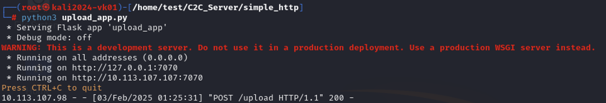
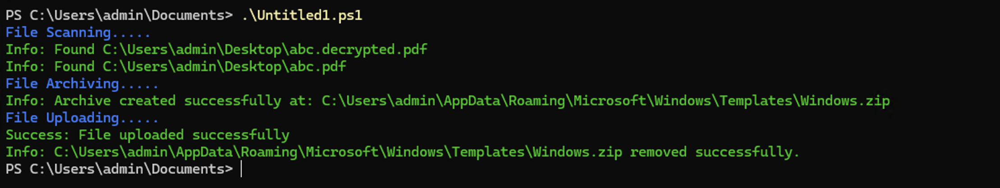

# File Upload System

This project allows users to upload files from a client to a server using HTTP requests. It demonstrates a basic file upload mechanism using PowerShell and a web server.

## Overview

The system consists of a **Client** that sends files and a **Server** that receives and processes these files. Below are the details of the client-side script and server-side setup.

## Server Setup

The server listens for incoming file uploads. It processes the file and stores it in a designated folder. You can configure the server to handle various file types, validate inputs, and even respond with confirmation messages after successful uploads.

### Server Image


**Server URL**: `http://10.113.107.107:7070/upload`

## Client Setup

The client is a PowerShell script that allows users to select a file to upload to the server. It sends the file via a multipart form-data POST request. If the upload is successful, it will output a confirmation message.

### Client Image


### Example Usage

```powershell
autoexfil.ps1
